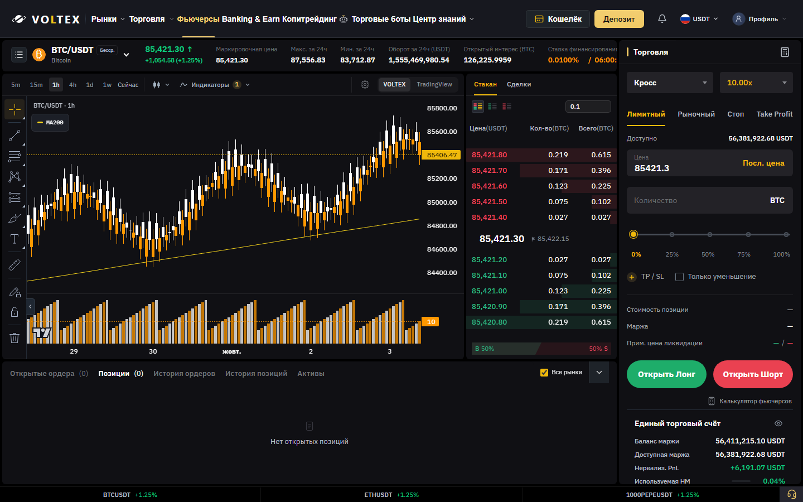
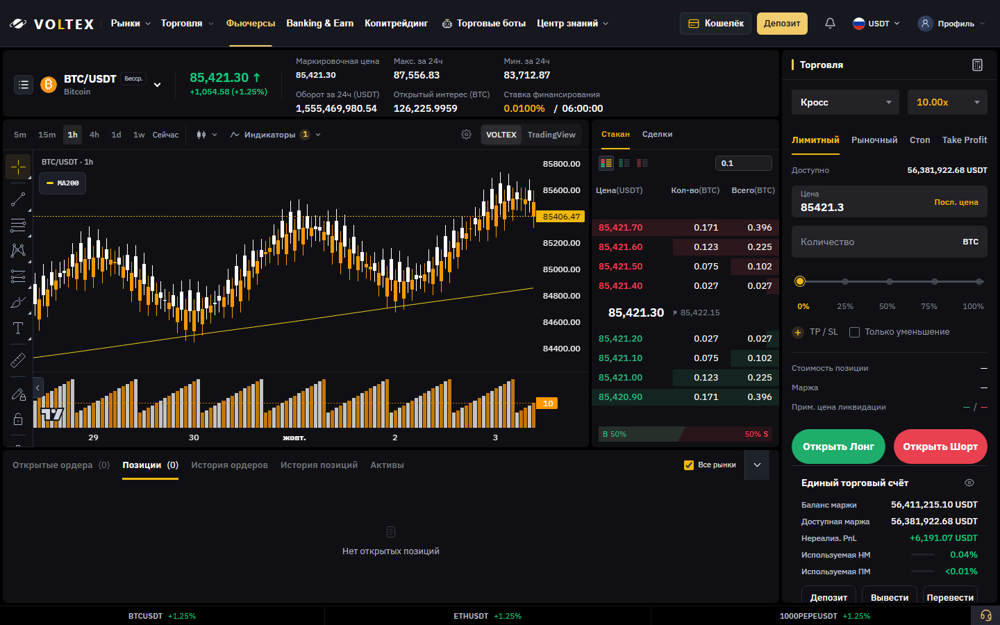
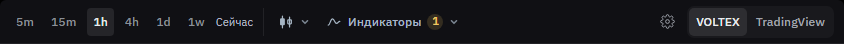
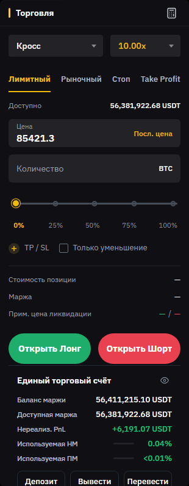

# Futures proportions — review evidence

Base: `e9efc4631fbd1472bef422034f2c035e0a8b6992` (current main after #395 and #396).
Product commit: `ea20d855c0d4d87aaf0533d427ff5f522e76e172`.
Review only: no merge, manual deployment, production requests or trading writes. The repository's existing Cloudflare integration automatically creates a branch preview on push; production is unchanged.

## Compare

Open `comparison.html` through the fixture server at `/__qa/evidence/comparison.html`.
It supports 1920 / 1664 / 1600 / 1440 / 1366 / 390, side-by-side or full-width before/after, header, ticker, toolbar, ticket and Spot crops.

The screenshots render the actual built application, including the real Futures/Spot routes and complete CSS imports. Both builds use identical synthetic market/account fixtures, a fixed timestamp and deviceScaleFactor 1. External network access is denied. The harness supplies local asset icons; remote font providers are blocked. Browser fallback/local fonts are the same in both builds.

| Viewport width | Ticket before → after | Chart before → after | Book (unchanged) | Ticker height after |
|---|---|---|---|---|
| 1920 | 350 → 310 | 1262 → 1302 | 292 | 56 |
| 1664 | 326 → 310 | 1052 → 1068 | 270 | 56 |
| 1600 | 326 → 310 | 988 → 1004 | 270 | 56 |
| 1440 | 326 → 310 | 828 → 844 | 270 | 96 |
| 1366 | 326 → 310 | 754 → 770 | 270 | 96 |
| 390 | Full-width trading workspace, 390 | 390 → 390 | Separate mobile workspace | 80 collapsed |

All measurements are CSS px. Heights: 1080 at width1920, 768 at1366, 844 at390, otherwise900.

## Actual dimensions and presentation

- Desktop ticket: 310px; internal horizontal padding14px.
- Selectors: 36px; fields46px; input figures16px. Mobile retains44px selectors and48px fields.
- Related gaps12px; major functional groups16px; calculation rows24px.
- Pair16px; last price18px; secondary figures14px; captions12px.
- Toolbar44px; buttons28px, label12px. Book and bottom tab bands44px with13px labels.
- Margin selector is wider than leverage so `Изолированная` remains complete at310px.
- All ticker statistics remain visible; the laptop layout reserves a second row rather than covering the chart or book.
- Funding rate uses the brand accent; countdown is neutral. Saved white/gold candle preferences are preserved.
- The duplicate calculator link below the ticket is removed; the accessible heading button opens the same calculator.
- Owner-requested header correction: the shared laptop rules left only 4px between rendered labels on Futures. Scoped spacing now provides at least 16px at1664 and13px at1600/1550/1531/1440;1920 retains20px. Menu structure and mobile navigation remain unchanged.

## Verification

- Frontend TypeScript and Vite production build: PASS (existing large-chunk warning remains).
- 355 distinct relevant tests across12 suites pass, including order-form/calculator behavior and unchanged arithmetic fingerprint. The final selector correction was rerun in the18-test Graphite suite.
- Existing Futures browser QA: PASS at1920/1664/1440/1366 plus320/360/390/430, including local fixture order submission, calculator, book grouping/trades/price-click, clipping and overflow.
- New real-route before/after QA: six widths; no document/ticket horizontal overflow or page errors.
- Header regression: rendered text/icon gaps, label clipping, account overlap and every visible dropdown checked at all desktop matrix widths, plus1531/1550 around the existing secondary-menu breakpoint. Zero violations. The related143-test/8-suite guard run also passes.
- Populated positions: three real rendered fixture rows; empty/loading/error states tested. Unavailable account values stay unavailable and submission stays disabled.
- Price/quantity focus and long numeric input, TP/SL, reduce-only, margin/leverage menus, all order-type tabs, long pair, small price, mobile expanded ticker and workspace switching are exercised.
- Wallet → Futures → Spot → Futures uses real SPA navigation. Returning to Futures preserves its layout. Chart settings keep the same canvas identity; selected timeframe and stored drawing persist. Passive resize/style interaction adds zero requests in the measured window.
- Spot screenshots are byte-identical before/after at every one of the six widths. Existing Spot/CFD browser harness also exits successfully.
- Full Windows frontend run initially exposed five pre-existing path-separator source-scan failures, independently reproduced on unchanged main. Those tests were not modified by this work. Exact-head Linux CI is reported on the PR.

## Reproduce locally

```sh
npm ci --ignore-scripts
npm ci --prefix frontend --ignore-scripts
npm run build --prefix frontend
# Point QA_PLAYWRIGHT_MODULE at an installed Playwright module.
node scripts/qa-futures-proportions.cjs --phase after --out output/futures-proportions
node scripts/qa-futures-proportions.cjs --serve --port 4394 --out output/futures-proportions
```

The preview binds to127.0.0.1 and serves `/futures?pair=BTC%2FUSDT`, `/trade?pair=BTC%2FUSDT` and fixture account routes. It refuses order writes. `--dist` selects a separately built unmodified baseline for the before phase. The GitHub workflow uploads generated evidence as an artifact.

## Limits

- Production authentication, real execution, live network behavior, backend and financial data are deliberately untested and unchanged.
- This is Chromium fixture QA, not a cross-browser certification. External TradingView and font services are blocked.
- Header changes are limited to laptop spacing within the Futures route. The existing shared menu visibility breakpoints remain in force.
- At laptop widths the second ticker row uses40px of vertical space to keep every statistic visible. Scrollable position tables and the existing mobile support widget remain unchanged.

## Representative screenshots

Before1440:



After1440:



After ticker:


After toolbar:



After form:


