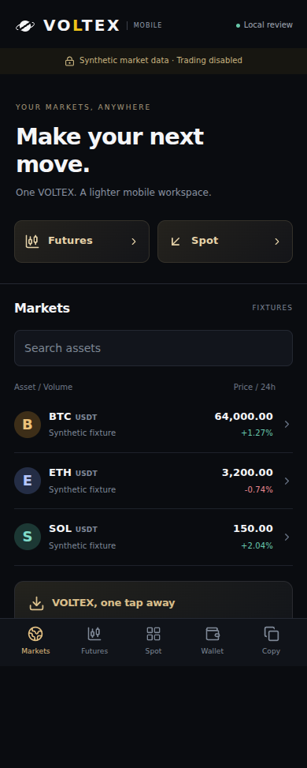
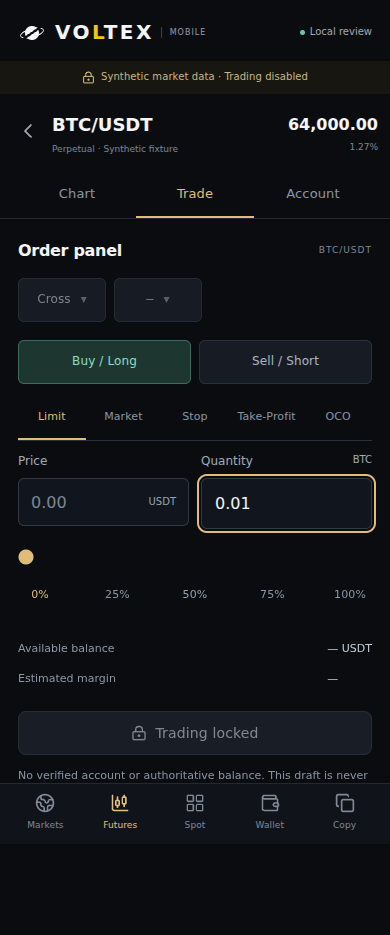
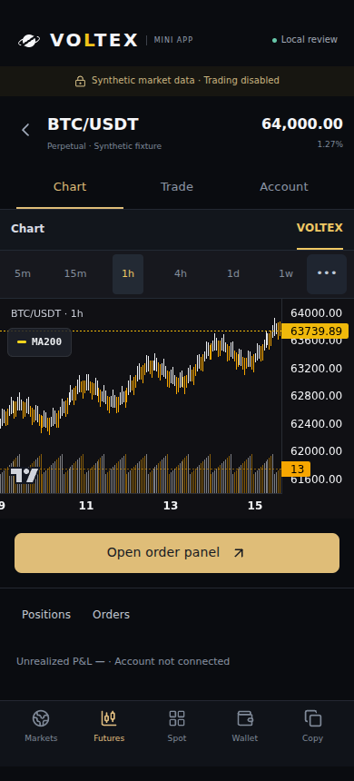
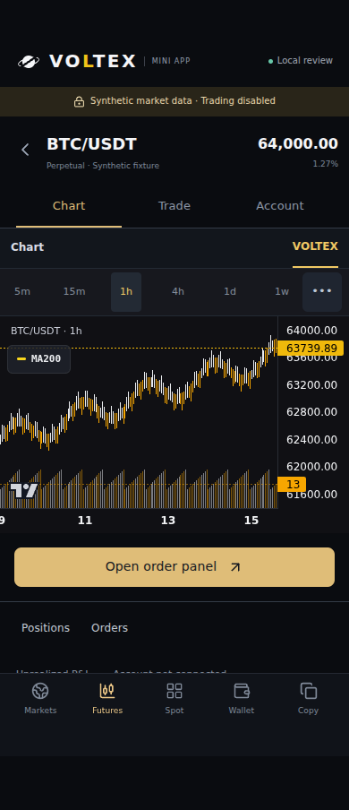
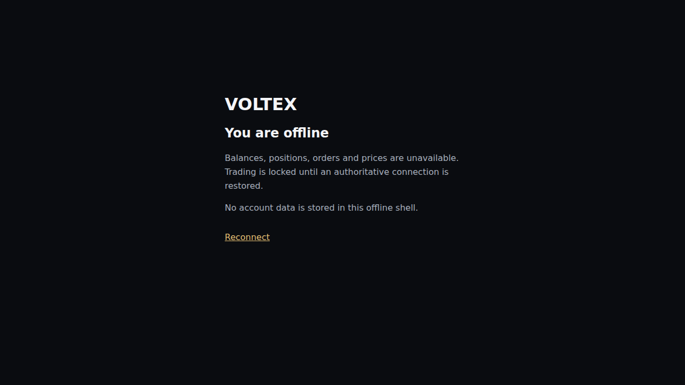

# Mobile review integration — 2026-09-29

This is local fixture evidence for the isolated PWA and Telegram review, not a public launch or real-account demonstration.

## Source identity

- Baseline: `c237649ccd93e74c68013c861ab9cbd38af56726`.
- Imported review: original PR #311 head `d0428bbc73b8ea77f45c89b976e7502559beb009`; only its 31 added mobile-specific paths were transplanted. Its 37 legacy-workflow job bypasses and old handoff were not copied over current main.
- Integrated safety/lifecycle source: `af8ee894b0463eebf06819ee1ecf1ae14457b19b`.
- Visual follow-up: `25a6931` reuses current Logo with the yellow L, removes inherited 64 px whole-page bottom padding from the compact chart, and removes the reserved row for drawing tools omitted in this review.
- Final browser source: `0ea014afa54fc311d4e1c9f3f1d5871d55210804`. The later evidence/handoff commit changes documentation and stored evidence only.
- Source fingerprint: `c757af13a3e0b93e8ff921c321baa6e98e08adfbdb148c9d717ae503677ac5d3`. [verification.json](verification.json) records all 31 source file blobs/SHA-256 hashes and hashes of the curated evidence.

## Checks actually run

| Check | Result and scope |
|---|---|
| CI boundary | PASS: only the new dedicated workflow is added; existing job triggers and conditions remain untouched. Dedicated job has read-only token, no secrets/environments/database service/deployment path. |
| Targeted unit/regression tests | **191/191**, eight suites on the integrated safety/lifecycle source. Includes existing Futures order/terminal, Spot presentation, chart and mobile parity. Later changes affect only review branding/CSS and the browser harness. |
| Independent security review | No blocker found for loopback review; separate reviewer reran both dedicated safety/HMAC suites, **22/22**. No public-launch assurance is claimed. |
| Ordinary frontend | Full TypeScript check and normal Vite build PASS on the integrated source. Normal output has no mobile directory or review-manifest reference; the review worker is emitted only by the isolated build. Production entry/routes/components were not modified. |
| Final isolated frontend | Full frontend TypeScript check and isolated Vite build PASS after the visual follow-up. Existing font-URL/chunk-size warnings are informational; fonts are explicitly emitted and included in the worker's tested static allowlist. |
| Browser scenarios | **9 scenario groups PASS**: PWA and Telegram at 320/360/390/430 px, plus the separate launch-denial/service-worker group. |
| Actual plot rendering | **8/8** client/width combinations contain rendered candle pixels and at least 200 px usable plot height. A mounted empty canvas is insufficient. |
| Browser network/error boundary | **0 API requests, 0 external requests, 0 page errors** across all harness contexts. Host lookalikes/remote IPv6 and writes are rejected by the local server. |
| Draft/lifecycle | Typed quantity survives offline/online, browser hide/show, pagehide/pageshow and Telegram deactivated/activated. Visibility cannot override a still-inactive Telegram or pagehidden state. Hidden chart stops fixture polling; Back returns Trade/Account → Chart → Markets. |
| Worker | Static assets only; no account/API cache, no forced takeover, waiting update preserves typed draft; offline navigation has no trade controls. This separate worker/navigation case uses the default desktop browser viewport. |

Runtime: Node `v24.19.0`, Chromium `153.0.8010.0`, locale `en-US`. Browser contexts emulate mobile touch layout; no physical iPhone/Samsung installation or real Telegram SDK launch occurred. The initial local run correctly failed its error gate because the system Chromium inherited invalid locale `en-US@posix`; the harness now sets `en-US` explicitly. No production chart workaround was introduced.

[report.json](report.json) is the unedited final browser report. The runner produced 14 screenshots; six representative files are committed here, and CI retains the full `output/mobile-review/` artifact. The implementation agent visually inspected the listed markets/chart/ticket, Telegram safe-area chart and offline shell after the final run.

## Preview








## Reproduce

```sh
node scripts/mobile-review-ci-safety.cjs
node scripts/mobile-review-checks.cjs
npm run build --prefix frontend
cd frontend
node node_modules/vite/bin/vite.js build --config vite.mobile-review.config.ts
cd ..
MOBILE_REVIEW_PLAYWRIGHT=/path/to/playwright node scripts/qa-mobile-review.cjs
```

For interactive local review, run `node scripts/serve-mobile-review.cjs`, then open `http://127.0.0.1:4178/pwa` or `http://127.0.0.1:4178/telegram?mock=1`.

## Remaining public launch work

See [MOBILE_CLIENTS_REVIEW.md](../../MOBILE_CLIENTS_REVIEW.md#public-launch-prerequisites) for the concrete HTTPS origin, bot identity, existing-account linking/replay, existing execution-provider integration and physical-device steps. This source does not add a production PWA route, register a production worker, link an account or enable a trade. No bot identity or token is assumed from the existing notification service; no paid resource was created.
