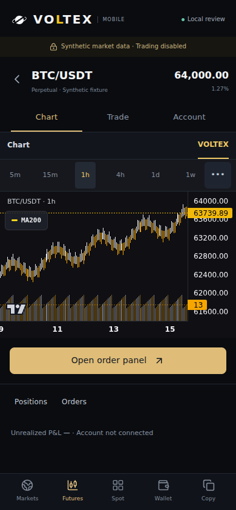
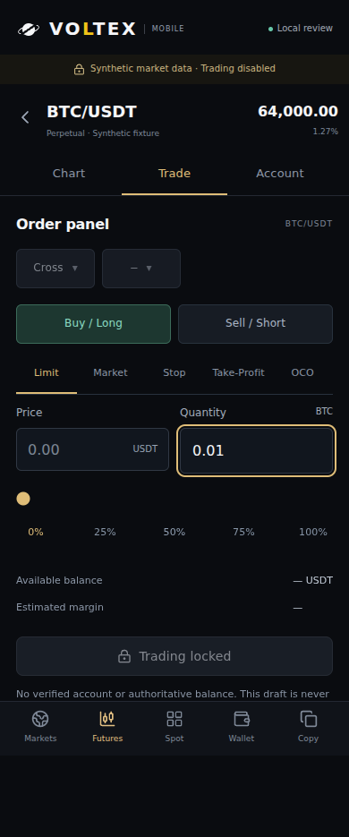
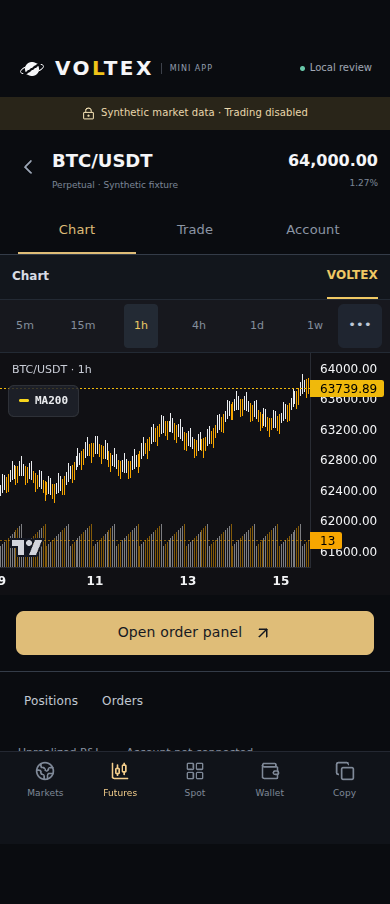

# Mobile review after shared browser lifecycle integration — 2026-09-29

The isolated PWA and Telegram review pass their complete local browser matrix on integrated source **`ea17fdc7413b4f41004693fd30088f962a2f1127`**. No mobile runtime adjustment was required after the shared idle work and main #343 were integrated. These results use fixture data and browser emulation; they do not establish a public launch, real Telegram authentication or physical-device installation.

## Exact source and evidence

The source was frozen in a separate detached verification worktree before either build or any test ran. Every check below used that same commit. This evidence commit changes only documentation and captured artifacts; it does not change the tested runtime. The earlier [mobile review evidence](../mobile-review-20260929/README.md) remains attached to its original source and has not been relabelled.

[verification.json](verification.json) records the full source tree, frontend/backend/script subtree IDs, 32 mobile source blobs and SHA-256 hashes, both fresh build fingerprints, and hashes of the raw report, logs and six selected PNGs. The mobile-source fingerprint is `9d678d717e8d12a7d6b37743928e06cb8a08cfbfb19b47173c92018919ae3912`. The complete integrated source identity is the commit and tree, rather than this narrower mobile-file fingerprint.

## Checks actually run

| Check | Result on the frozen source |
|---|---|
| Dedicated mobile tests | **198/198 PASS, eight suites, zero skipped**. The previous 191-case scope gained five controlled-error regressions and two shared Spot background-loading cases from #343. [Captured output](unit-tests.txt). |
| CI boundary | PASS: `mobile-review-ci-safety.cjs` confirms independent fixture coverage, no reintroduced historical workflow bypasses, read-only review permissions, no secret/deploy path and no review import in the production entry. |
| Ordinary frontend | TypeScript and normal Vite build PASS. The browser runner verifies no `mobile` directory or review manifest reference in that normal output. [Captured output](production-build.txt). |
| Isolated review | Separate Vite build PASS. Its loopback worker and review assets are emitted only in `dist-mobile-review`. Existing font-URL and chunk-size warnings remain informational. [Captured output](review-build.txt). |
| Browser matrix | **Nine scenario groups PASS**: PWA and Telegram at 320/360/390/430 px, plus the separate launch-denial and service-worker group. [Unedited report](report.json). |
| Painted chart and geometry | **Eight of eight PASS**: actual candle pixels, at least 200 px usable plot height, no horizontal overflow in the checked views, and primary controls at least 44 × 44 px. The current yellow-L logo remains visible at each width. |
| Browser network and errors | **Zero API requests, zero external requests, zero page errors** across the guarded browser contexts. The separate local-server probes reject remote/lookalike Host values and reject a POST with 405. |
| Draft and lifecycle | An unsent quantity survives offline/online, visibility changes, pagehide/pageshow and Telegram deactivated/activated. Chart polling stops while hidden; Telegram deactivation and pagehide cannot be undone by an unrelated visibility event. Back navigates Trade/Account → Chart → Markets. |
| Launch refusal | Invalid mock and missing SDK remain unavailable. A synthetic SDK-shaped object exercises the non-mock launch refusal: controlled account-unavailable text appears, the market workspace stays unmounted and raw launch details are not echoed. This object is not a real Telegram session. |
| Service worker | Static assets only; no account/API cache. An update remains waiting while an open quantity draft stays `0.123`. Offline navigation shows the locked shell with no buttons. This last group uses the default desktop viewport. |

The three validation logs preserve the process output with trailing line-end whitespace removed. The browser JSON is an unchanged copy of the runner output.

Runtime: Node `v24.19.0`, Chromium `153.0.8010.0`, explicit locale `en-US`. The eight layout contexts emulate mobile touch with DPR 1 and height 844 px. The wrapper supplies the locally available Chromium executable; no fresh browser installation or remote service was required.

## Shared lifecycle result

The ordinary application starts `browserActivity` and its session validation from its own entry. The separate review entry does not start that production session lifecycle. Shared transports therefore retain their documented inactive-controller fallback to the review's already locked global fetch, while the review's own browser/Telegram hook controls chart mounting. The integrated browser result confirms the relevant behavior: fixtures render, hidden/minimized charts stop work, drafts survive, and no browser API request escapes the lock. This is evidence for these exercised review paths, not a claim that every production idle path was covered by this runner.

The six captures below were visually inspected after the run. The runner produced fourteen screenshots in `output/mobile-review/`; six are retained here. A full-page capture can include content below the emulated viewport while the bottom navigation stays fixed at its viewport position.

## Selected captures








## Reproduce

Use the source commit above with the repository dependencies available, then run:

```sh
node scripts/mobile-review-ci-safety.cjs
node scripts/mobile-review-checks.cjs
npm run build --prefix frontend
cd frontend
node node_modules/vite/bin/vite.js build --config vite.mobile-review.config.ts
cd ..
MOBILE_REVIEW_PLAYWRIGHT=/path/to/playwright-wrapper.cjs node scripts/qa-mobile-review.cjs
```

For an interactive local preview, run `node scripts/serve-mobile-review.cjs` and open `http://127.0.0.1:4178/pwa` or `http://127.0.0.1:4178/telegram?mock=1`.

## Remaining launch prerequisites

[MOBILE_CLIENTS_REVIEW.md](../../MOBILE_CLIENTS_REVIEW.md#public-launch-prerequisites) retains the concrete requirements: an approved HTTPS staging origin/build, explicit bot identity and server-held credential, existing-account confirmation plus replay/session protections, existing provider integration on disposable staging, and real iOS/Samsung and Telegram checks. This verification creates no account, public route, production worker registration, resource, credential or financial operation. Root retains the combined release and external-operation gates.
