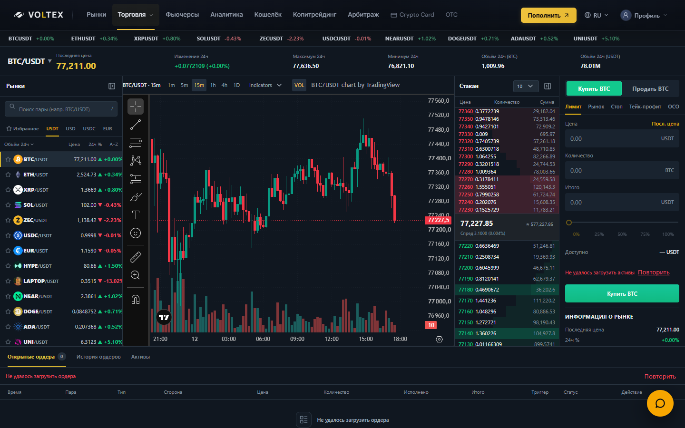
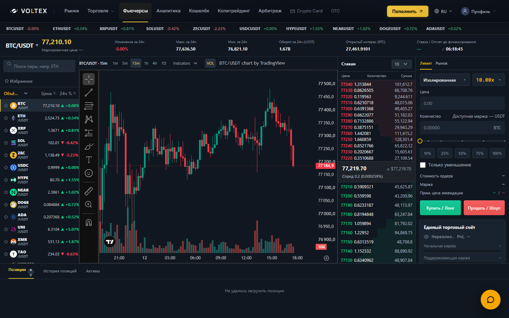
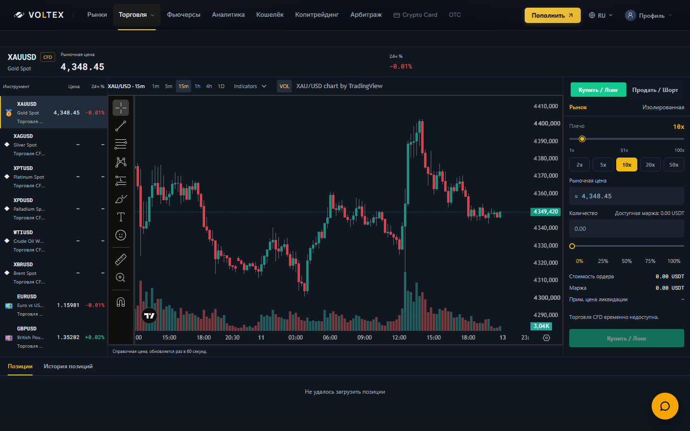

# Professional terminals — review evidence

New branch `codex/unified-professional-terminals`, created after fetching actual main `39bd779df864b9e1ac3c654e82dad5210462c79e`. During implementation main advanced to `cd1d646bd0dbe9b42d6cb21e4445430ce43934a1` (PR #41, two Crypto Card yield files only). Those files are outside this change; no merge, rebase, production deployment or production setting change was performed.

## Changes

- Spot / Futures / CFD share a denser terminal surface, input/CTA treatment, compact stats and responsive rules. Futures gains chart area by reducing side columns. Existing Spot market-panel resizing/collapse remains intact.
- Spot and CFD size ranges call their existing percentage-sizing functions; existing shortcuts, submission payloads, balances and risk checks are unchanged. Futures keeps its existing size/margin/leverage controls. CFD remains MARKET-only and fail-closed; there is no CFD order book.
- A shared official TradingView advanced-chart embed replaces the separate CFD `tv.js` widget. Each effect owns a fresh disposable subtree (including StrictMode replay); cleanup removes/navigates away its iframe. A delayed old script cannot attach to the current owned subtree. Script failure or absence of a widget has a retryable unavailable state.
- VOLTEX owns 1m / 5m / 15m / 1h / 4h / 1D controls and the matching label. Native top/time-range controls are hidden using documented configuration. Drawing toolbar, volume and supported SMA / Stochastic RSI / ROC presets remain available. The selected interval survives symbol switching within the component. Required attribution remains visible in the controls, without a separate desktop footer strip. No iframe branding is obscured or modified.
- Book grouping and clicked order prices are unchanged. Both sides use the same seven-significant-digit display formatter for amounts and totals; tiny nonzero amounts remain nonzero and extreme values use scientific notation. Exact numeric values are available in cell tooltips. Aggregation and submitted values are not rounded by this formatter. Subdued depth bars and tabular numeric alignment.
- Turnover keeps the existing derivatives aggregate, with a reference-only fallback to the matching fresh Bybit linear perpetual row in the existing shared SSE store. Identity, market type, quote/settlement/turnover units, freshness and nonnegative finite values are checked. Spot, inverse, dated and mismatched units cannot substitute. Real zero remains zero; unavailable remains a dash. Financial mark/index/funding reads are unchanged.

## Validation

- Frontend TypeScript: PASS.
- Frontend production Vite build: PASS. Environment-only same-version esbuild WASM runner was used because this Windows sandbox blocks Node child-process pipes. No dependency or build-config change.
- Relevant tests: **384 passed / 2 pre-existing failures**, 14 suites; pristine current main `cd1d646...`: **355 passed / the same 2 failures**, 13 existing suites. **New failure names: 0.** No full backend suite was run.
- Existing failures: `nobody fetches /futures/config except the store the endpoint has exactly one client method, and one caller` (Windows path separators); `Futures UI-only reconciliation pages/FuturesPage.tsx preserves non-visual semantics` (fingerprint already stale on main). Neither assertion was weakened. Book preservation restores only the explicit display changes before comparing its original semantic fingerprint; behavioral grouping/click tests also pass.
- Real Edge browser / production frontend build: all three markets at 1920×1080, 1440×900, 1366×768, 390×844. Document/body widths equal viewport widths. No page errors. Form CTAs remain reachable inside their scrolling panels at 1366×768.
- Ten distinct symbol selections per market: maximum one attached chart iframe. Spot and Futures end with one; CFD correctly has no chart for an unmapped instrument, then one after a mapped selection. Separate React DOM tests also cover ten rapid changes, StrictMode replay, detached late scripts, unmount, retry, missing-widget timeout and interval/indicator/volume changes.
- Browser clicks on 1h / 1D verified both the visible label and actual iframe configuration `60` / `D` for all three markets.

## Scope and review limits

This is a local read-only QA harness (`node scripts/qa-professional-terminals.cjs`, then `http://127.0.0.1:4196/__qa/start`). It uses an explicitly local fixture identity, anonymous unmodified public market GETs and no production credentials. Private account requests intentionally return unavailable; screenshots therefore include account/order-load errors. All non-GET writes are blocked. No production financial action was tested or performed.

Free TradingView embeds have no supported parent interval-change/drawing persistence API. The supported controls rebuild the embed; unsaved widget drawings/settings can reset on interval, indicator or symbol changes. Official widget/provider availability and symbol coverage remain external constraints. The six existing verified CFD mappings are preserved; seven other catalog instruments show unavailable instead of a fabricated or guessed chart. A missing external iframe is not counted as a second/hidden chart.

The exact 390×844 captures use viewport screenshots: full-page capture intermittently blanks cross-origin chart canvas pixels in Chromium, although direct viewport inspection renders correctly. Additional `*-390-order-entry.png` screenshots show the forms. See `browser-qa.json`, `controls-qa.json`, and `test-results.json` for measured results.

## Screenshots

| Spot 1440×900 | Futures 1440×900 | CFD 1440×900 |
| --- | --- | --- |
|  |  |  |

All four requested viewport sizes and separate mobile entry-panel captures are in this directory.

## Official widget documentation checked

- [Attribution / supported customization](https://www.tradingview.com/widget-docs/faq/general/): no assumed permission to remove branding/attribution.
- [Advanced chart widget](https://www.tradingview.com/widget-docs/widgets/charts/advanced-chart/): official embed configuration.
- [Technical-analysis example](https://www.tradingview.com/widget-docs/widgets/charts/advanced-chart/demos/technical-analysis/): supported study identifiers used here.
