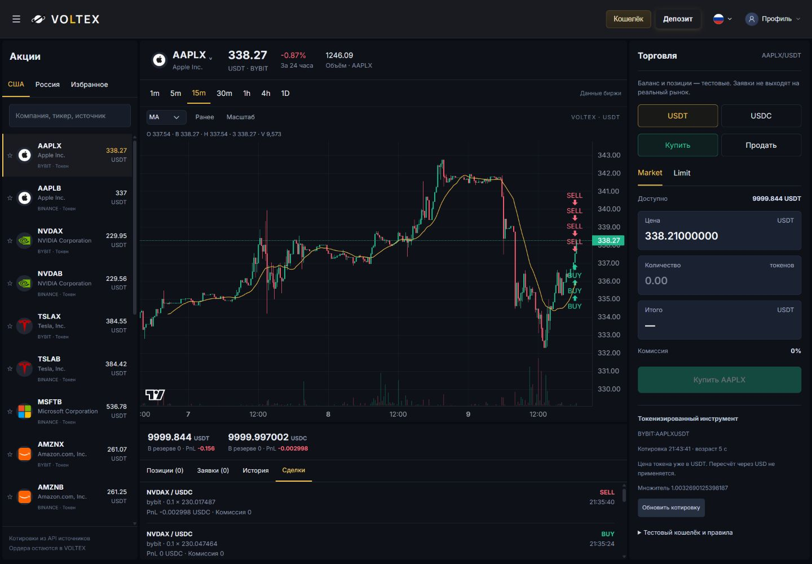
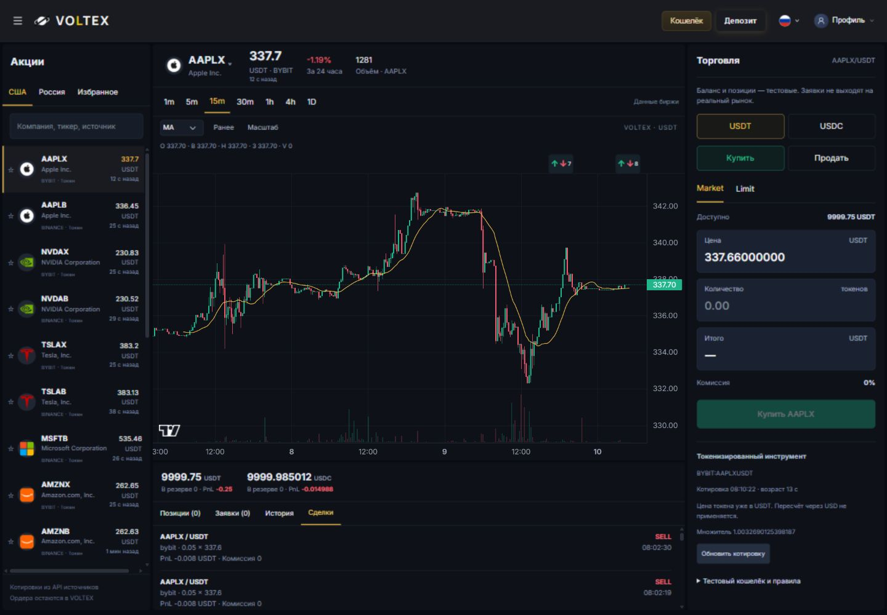
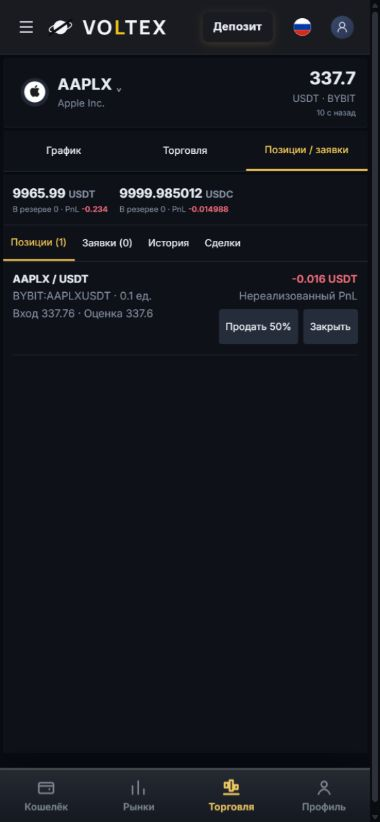
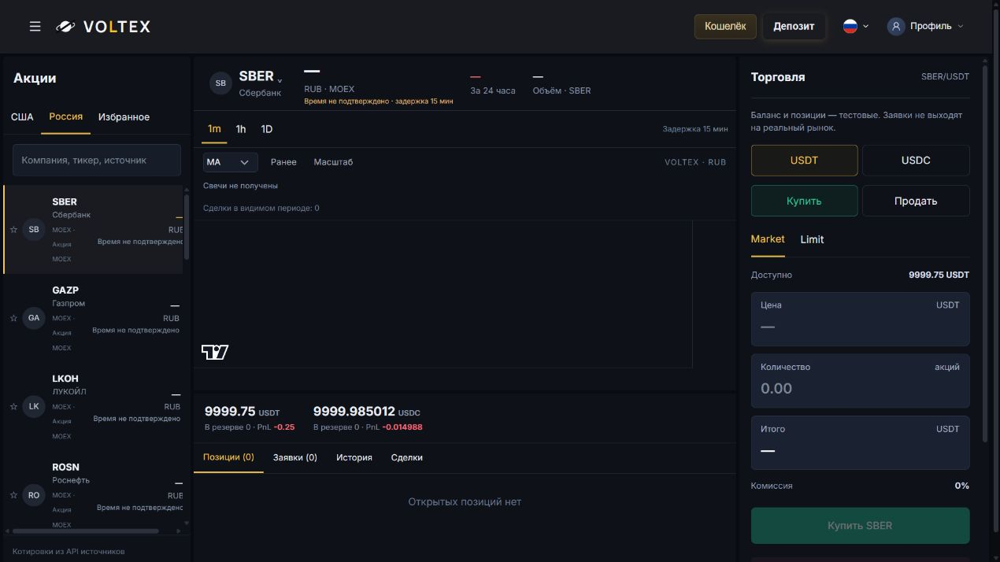

# Stocks terminal final corrections — local review, 2026-10-10

Preserved simulator commit: `2035ad6fb287d325b7d04132d05dd0f0e8077d40` in its original clean worktree. Fresh-fetched main: `1d0fae9c3f3ccd4ec9aa995038e3eb0d4476230b`. This independent review branch carries the Stocks prerequisites from still-Draft/unmerged #471 (`13fe4a8`) and #481 (`1cc0e7a`), plus both saved simulator versions. No admin #489 or separate Mobile UX work is included. No production access, merge, deployment, migration, real funds or external order submission.

## Changes

- Removed repeated BUY/SELL text. Green up/red down arrows live in a dedicated time-aligned rail outside the candle/indicator/price area. Executions on a candle share a count; groups that would overlap when zoomed out also collapse without modifying fills. Desktop targets are 40 px wide; mobile targets are 32 px. A keyboard-accessible modal exposes each execution's original time, native/settlement price, quantity, direction and realized result; Escape/close restores focus.
- Preserved chart/trade/positions tabs. Compact asset/price/quote-age header, sticky tabs, safe bottom padding, bounded chart/forms/account rows and visual-viewport/focus handling for order fields. Direct MOEX URLs select Russia and native 1m rather than unsupported 15m.
- Last-known prices show observation age, including after refresh failure. Market admission still fails closed on stale quotes/FX, unavailable identity, closed sessions or disconnected local account.
- RUB/USDC audit now retains both FX legs and their composite RUB-per-USDC rate. Historical fills remain untouched. Conversion arithmetic and admission rules are unchanged.
- Replaced raw caught error messages with bounded transport codes and an explicit safe-message map. Applied the same transport boundary to the preserved V1 fallback. Unknown HTML, stack traces, arbitrary codes and prototype names cannot render.

## Verification and scope

- TypeScript: passed. Enabled and default-off local production builds: passed; existing >500 kB chunk-size advisory remains.
- Node tests: 52 passed, zero skipped. Both simulator generations, independent durable ledgers, oversell/negative balance guards, reservation release, idempotency, stale/session/FX admission, provider separation and HTTP isolation are covered.
- Corrected targeted frontend run: 275 tests / 17 suites passed, zero skipped. Includes every suite that failed the initial complete run, all Stocks suites, marker grouping/detail interaction and safe error handling. The first complete run exposed source-contract/asset checks affected by Windows CRLF, plus the Stocks copy/error-boundary issues above. Repository LF text was restored in this isolated checkout; unrelated files whose committed content intentionally contains CRLF retain their original exact bytes. No assertions were waived. Full frontend remains a required CI check; see the PR's exact-head results for the final complete run.
- Browser: desktop 1440 px and mobile 320/360/390/430 px. Page scrollWidth equals clientWidth throughout; markers end above the plot and do not overlap each other. At 1440 the plot ends at x=1112 and the trading panel starts at x=1116. A reduced 390×430 viewport keeps the focused quantity input visible (y=183–216), with sticky tabs y=0–42. This is browser emulation, not a physical iOS/Android keyboard certification.
- Real local browser cycle: AAPLX/USDT buy 0.6 at 337.77 → sell 0.3 + 0.3 at 337.64; buy Limit 0.2 at 100 → 20 USDT reserved → cancel releases all 20. AAPLX/USDC buy/sell 0.1 with observed USDC/USDT=1.00078; no implicit USD peg. Reload and local server restart preserve history. A second mobile round trip bought 0.1 and sold 0.05 twice through the positions controls.
- Original nine fills remain byte-for-byte unchanged. Final tested ledger: 17 fills, 19 orders; no open positions or reservations. Cash USDT=9999.75000000, USDC=9999.98501157; realized USDT=-0.25000000, USDC=-0.01498843 (includes earlier preserved review history). All funds are local paper entries.
- Complete desktop cycle network capture: seven writes, all to `127.0.0.1:4438/__stocks_global/orders` or `/cancel`, no external write. Subsequent long-running browser capture was truncated and is not claimed as complete-session proof. Provider adapters use allowlisted GET requests only; local routes reject real API/admin/V1 paths, cross-origin writes and injected quotes. No production database or trade connector is imported.

## Real sources and remaining blockers

- Fresh finite probe: all 20 connected US instruments returned real source data, preserving Bybit xStock vs Binance bStock identities. Apple candles verified on all seven offered native intervals. At the probe snapshot 13 instruments were executable and seven Binance instruments were QUOTE_STALE; stale prices cannot execute. These states naturally change with market observations.
- Previously investigated OKX, Bitget, KuCoin, MEXC, BingX, Phemex and Kraken catalogue endpoints again returned HTTP 200. Their distinct token symbols are not connected or silently substituted into the chosen 20 instruments.
- All 20 MOEX catalogue candidates, including SBER/GAZP/LKOH/ROSN/NVTK/TATN/YDEX, remain unverified live: ISS fails DNS resolution (`EAI_AGAIN` / `SOURCE_DNS_UNAVAILABLE`); the CBR reference request times out. The Russian preview displays RUB, declared delay and unavailability, with Market disabled. SBER accounting/session/FX/Limit behavior is unit-tested with explicit fixtures, but a real-data SBER buy/sell cycle is **not passed**. MOEX history pagination and production data-use rights remain review prerequisites.
- Single local shared ledger, one writer, no multi-user account isolation service. No leverage, shorts, real ownership or external execution. Fill capacity is the documented paper model (one native unit per observation), not an exchange-liquidity promise. Public data access does not establish commercial redistribution rights.

## Preview and images

Run the existing `services/stocks-global` workflow with a separate ledger path. Current local preview: `http://127.0.0.1:4438/stocks/BYBIT%3AAAPLXUSDT`; Russian error-state preview: `/stocks/MOEX%3ATQBR%3ASBER`.

Before is the preserved 2026-10-09 screenshot; after uses current 2026-10-10 real observations. Price movement between screenshots is not a controlled visual fixture.

