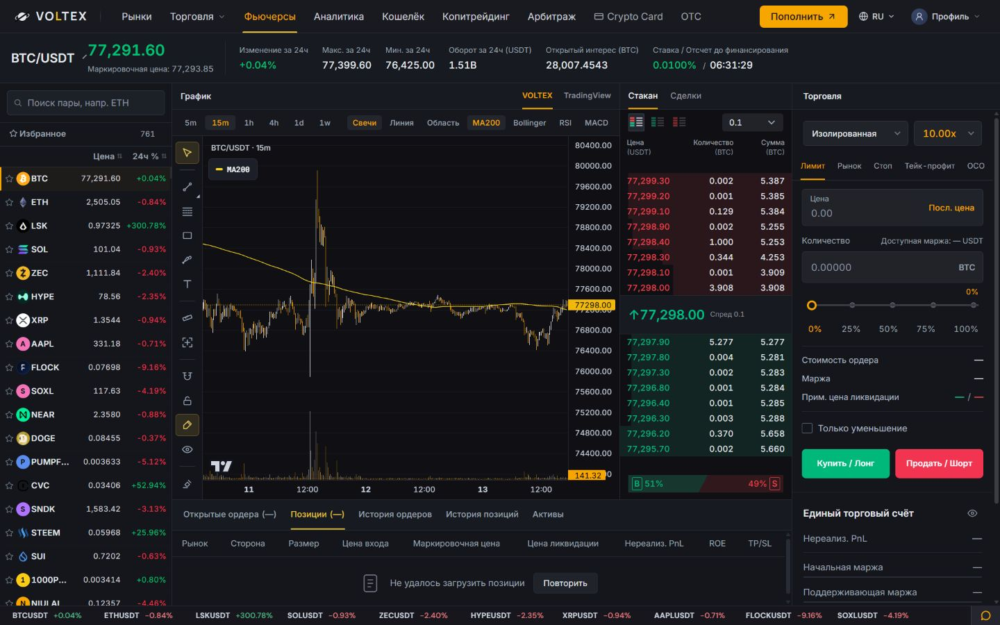

# Futures graphite proposal

Continues terminal-layout-repair without replacing prior work. Unified graphite panel backgrounds and 38px headings, aligned chart toolbar, compact 248px desktop book, 22px depth rows with 12px tabular numbers, restrained form surfaces and action buttons. Preserves own chart, native alternative, left search, all five order families and their execution guards. No financial handlers changed.

Validation: 105 focused book/page/order-panel tests passed; frontend TypeScript and production build passed. Browser desktop 1440px: 38px chart toolbar, 22px book rows, 16 real levels rendered, no horizontal overflow. Mobile 390px DOM overflow check passed; screenshot capture was inconsistent, so no additional mobile visual certification. Normal 1280px viewport restored. Previous full-suite baseline remains 71 known failures; not rerun for this bounded styling change.

Preview: http://127.0.0.1:4210/futures . Production remains unchanged. Local private account reads are blocked by QA harness.

