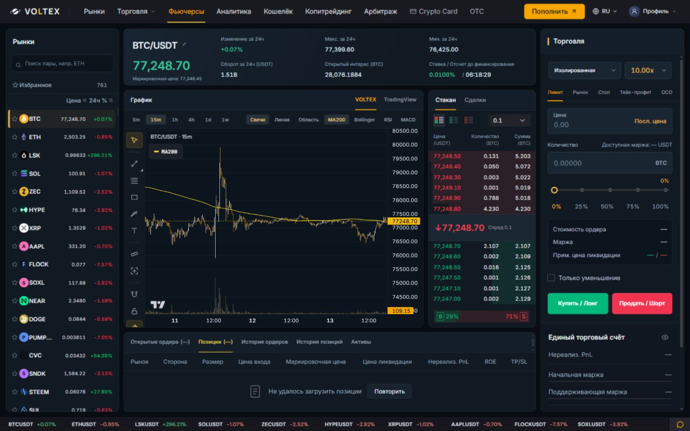
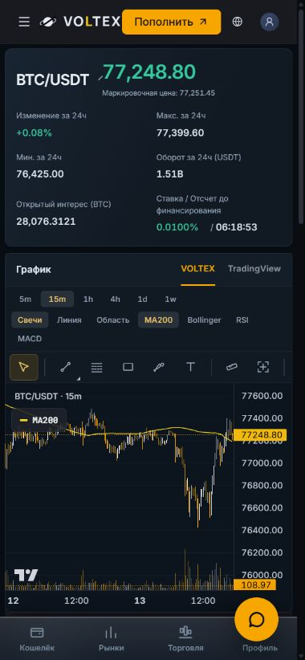

# VOLTEX Futures — independent composition

Preview: http://127.0.0.1:4210/futures?terminalDesign=studio
Existing design: http://127.0.0.1:4210/futures

## Design

Separate full-height market and execution rails surround a central market workspace. Instrument overview uses a two-row hierarchy with a prominent price, while the graph and compact book form a paired working area. Positions form a separate lower panel. Deep graphite-blue surfaces, restrained gold details, consistent 9px corners and 10px gutters replace the uninterrupted grid. The owned chart inherits the new surface through a scoped CSS custom property; its original background remains the fallback outside this variant. No new financial information is invented.

Implementation is opt-in through terminalDesign=studio. Existing design, all order forms and their execution guards, data feeds, chart tools and TradingView alternative remain. Source changes: FuturesStudio.css, FuturesPage.tsx, PriceChart.tsx and an opt-in preservation test.

## Validation

193 focused tests pass across six suites (Futures page/order/book, chart order behavior, formatting and drawings). Frontend TypeScript and production build pass; Vite 6.16 seconds. No new full-suite run for this presentation variant. Prior recorded 71 full-suite failures remain outside scope.

Browser: 1440x900 and 390x844 visually checked, no horizontal overflow. Search BTC to ETH and back works. OCO value 80000 survives book-to-trades switching. Switching contract resets order draft as before. The live trades feed and exact-contract book render. No financial submission. Local QA deliberately blocks private reads/writes, so account unavailable states are retained.

Not merged or deployed. Normal browser viewport restored.
