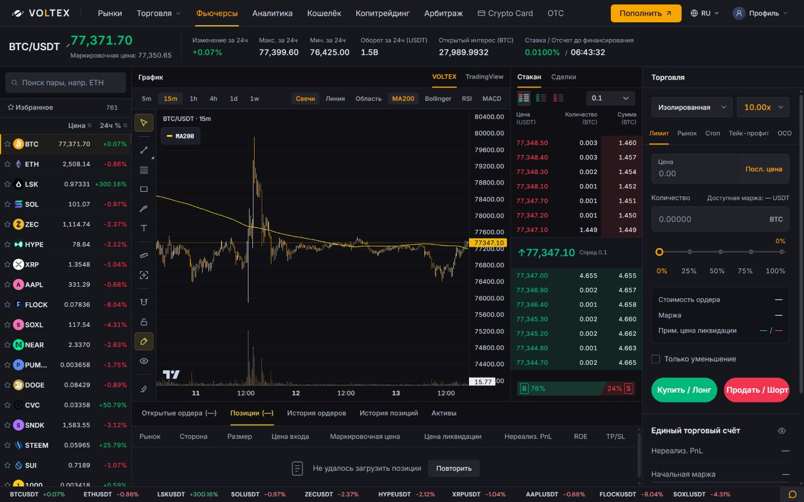
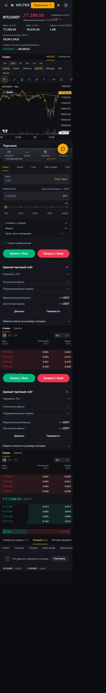

# Futures layout and stream repair — 2026-09-13

Base: 9f65ee1461d6db0ac8cefb14b54a347e1d75067c. Branch: codex/terminal-layout-repair.
Continued existing working-tree changes without reset or replacement.

## Changes

- Connection banner observes the validated Futures depth stream instead of an unused Spot socket. Real sustained loss still appears after the existing two-second grace period; recovery clears it.
- Restored compact graphite depth ladder with book/trades tabs, bid/ask modes, whole-row sizing, default smallest grouping, freshest valid execution price, exact price picking, and cumulative base-quantity totals.
- Recent trades use the same exact-contract public linear websocket as depth. Validate identity, timestamps, positive decimal price/quantity; batch at 300 ms, cap 40, clear on disconnect/hidden tab, ignore late socket events.
- Full-width market header, aligned panel headings, bounded asset names, compact book typography, wrapping chart tools and horizontal drawing rail on small screens.
- Preserved all five order-family forms, their existing presentation-only execution guards, own chart and native TradingView alternative. No backend, balances, matching, margin, PnL, funding or liquidation code changed.

## Verification

- Focused stream, banner, book, page and order-panel suites: 122 passed / 0 failed (5 suites).
- Full frontend: 1252 passed / 71 failed / 1323 total (82 suites); completed in 67.373 seconds.
- Compared exact failed test names with the previously recorded full chart-restoration run: 0 new, 0 disappeared. This is a stored prior-run comparison, not a new pristine-main execution. Full suite is not green; failures are listed in terminal-repair-failures.json.
- Frontend TypeScript and production build passed. Final Vite bundle built in 8.42 seconds. git diff --check clean.
- Actual browser: 1440 x 900, 833 x 1000, 390 x 844; no horizontal page overflow. Desktop sidebar shows 761 contracts. Live depth/trades render; bid-only/both modes work; OCO take-profit value 80000 remains after switching the book tab and chart timeframe. No order submitted.
- Local read-only QA server proxies public data; private account reads are deliberately blocked. Local account unavailable states are expected. No account balances were fabricated, no financial write tested, no production-readiness claim.

## Evidence

This repair has not been deployed. Existing product-readiness limitations documented in investor-journey.md remain.
