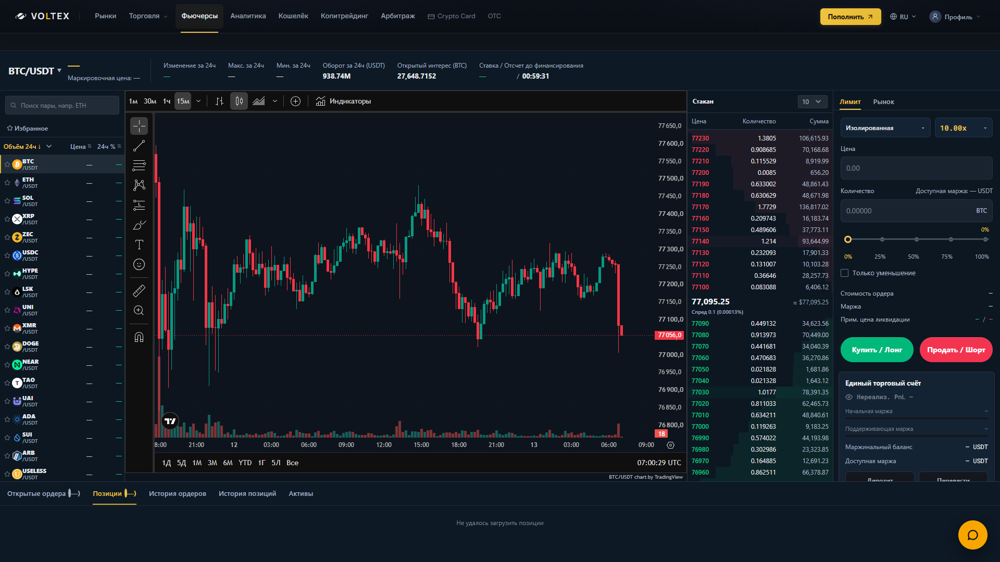
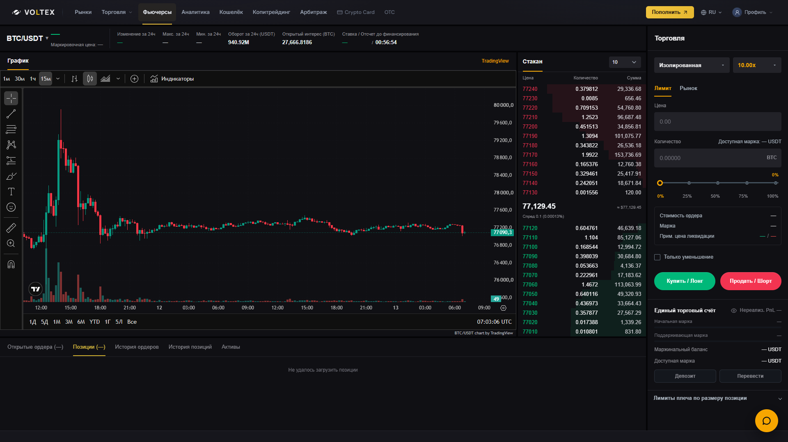

# Futures terminal — owner-supplied Bybit visual reference

Base: `0f7ab66f9af6e5e1a33ff0356182a2174b804c66` (freshly fetched GitHub main, 2026-09-13).
Branch: `codex/terminal-reference-layout`. Review only; no merge/deployment.

## Presentation

- Desktop chart/book/order rail replaces the permanent four-column market sidebar. At 1920px the chart is 1257.6px, book 316.8px and rail 345.6px. The right rail spans the instrument header and lower positions area.
- Markets open from the instrument name in a native modal dialog. Existing search, sorting, favorites, virtualization and contract selection are retained. Search receives focus; Escape closes and restores focus.
- Neutral charcoal surfaces, orange active accents, aligned book columns, compact input treatment and one integrated account rail. Margin/leverage are above Limit/Market; existing sizing and order controls remain functional. Count labels no longer inherit decorative shared badges.
- Market tape moves below the workspace. Tablet uses chart above book/form; mobile uses chart, form, book, positions. The existing mobile navigation remains fixed and content scrolls behind it.
- Futures chart canvas uses the official TradingView background/grid options. Spot and CFD keep their original colors and symbol mappings. Native timeframe/indicator/drawing controls and attribution remain intact.

This is a VOLTEX implementation of the reference's hierarchy and proportions, not a pixel-identical copy of Bybit's private chart integration. Unsupported Post-Only/TIF and order-entry TP/SL controls were not invented. VOLTEX branding and the real existing APIs remain.

## Actual browser evidence

Same 1920×1080 viewport, same read-only local harness, current main versus candidate:

| Current main | Candidate |
| --- | --- |
|  |  |

[1440](futures-1440.png) · [1366](futures-1366.png) · [1024](futures-1024.png) · [768](futures-768.png) · [390 chart](futures-390-chart.png) · [390 order controls](futures-390-controls.png) · [Market selector](market-selector.png)

`browser-results.json`: all six viewport widths have no page overflow, one native chart iframe matching the container width, and fitting action labels. Desktop rail and bottom panel end together; tablet book and form share a row. Twenty alternating BTC/ETH selections verified the matching BYBIT perpetual iframe without stacking. Search focus, Escape/focus restoration and mobile controls above the fixed navigation were checked. Screenshots use actual public data only; private account requests are intentionally unavailable and all writes are blocked by the QA harness. Missing ticker/mark/account values are visible as unknown, not filled with sample numbers. The first mobile full-page capture had a headless iframe paint artifact; viewport screenshots above verify the actual rendered chart.

Local preview: `http://127.0.0.1:4202/__qa/start?market=futures` (requires the running local QA server). This is not a deployed branch URL.

## Validation

- Frontend TypeScript: PASS (`node frontend/node_modules/typescript/bin/tsc -b frontend`).
- Vite production build: PASS. Windows environment runner uses the same Vite/React configuration with in-process esbuild WASM because native Node pipe creation is restricted; no dependency or build configuration change committed.
- Six focused suites (`futuresOrderPanel`, `futuresFinalPolish`, `futuresAccountUnknownState`, `cfdChartFallback`, `terminalPresentation`, `spotOrderBook`): **166 passed, 4 failed / 170**. Four new chart palette/ownership cases pass.
- Same six suites in pristine worktree at exact base main: **162 passed, 4 failed / 166**.
- Additional account-store and position-protection suites: **52 passed / 52**.
- **New failures versus main: 0.** Existing failing assertions were not weakened or rewritten:
  - `timeframe label is driven by the exact interval sent to the chart; controls cannot drift`
  - `native TradingView indicators toolbar is enabled and volume remains controllable`
  - `verified CFD mapping and compact visible attribution are preserved`
  - `Spot tiny-price rows keep unchanged full numeric labels and narrowly scoped non-overlapping cells`
- The first three still expect parent controls already removed on main in favor of the native widget. The fourth expects an older Spot total formatter. Both implementations and all four assertions predate this branch.
- No full backend suite claimed: backend/collector, account state, order payloads, matching, balances, funding, leverage/risk formulas and protection logic are unchanged. Diff whitespace check passes.

To repeat browser QA, run `scripts/qa-professional-terminals.cjs` with `TERMINAL_QA_PORT=4202`, then `scripts/qa-terminal-reference.cjs` with `PLAYWRIGHT_PATH` and `EDGE_PATH` pointing to the local Playwright module and browser executable. No market/account fixture values are injected.
